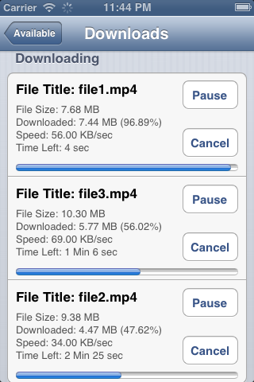

ZeeDownloadManager
==================

<b>Features:</b>
  
1) This download manager uses the ASIHTTPRequest classes to download files.
 
  
2) Can download files if app is in  background.
 
  
3) Can download multiple files at a time.

  
4) It can resume interrupted downloads.

  
5) User can also pause the download.

  
6)User can retry any download if any error occurred during download.

Screenshot

<b>USAGE:</b>

You need ASIHTTPRequest classes get it https://github.com/pokeb/asi-http-request and setup your project Copy the ZeeDownloadsViewController.h ,m and xib file in your xcodeproject.
<b><u>STEPS</u></b>
  
1)Initialize ZeeDownloadManagerViewController. (Must retain its object. Otherwise app will crash)

  
2)Set delegate

  
3)Initiaze array with urls

  
4)"resumeAllInterruptedDownloads" call this instance method to resume interrupted downloads

  
5)Setup your tableview and list down the URLs

  
6)Use the following delegate methods.

    -(void)downloadRequestStarted:(ASIHTTPRequest *)request;
    -(void)downloadRequestReceivedResponseHeaders:(ASIHTTPRequest *)request responseHeaders:(NSDictionary *)responseHeaders;
    -(void)downloadRequestFinished:(ASIHTTPRequest *)request;
    -(void)downloadRequestFailed:(ASIHTTPRequest *)request;
    -(void)downloadRequestPaused:(ASIHTTPRequest *)request;
    -(void)downloadRequestCanceled:(ASIHTTPRequest *)request;
    
  Thats it

<b>Precautions:</b>

  
1) Don't start multiple downloading with the same URL. It will cause inconsistency.

  
2) Must retain the "ZeeDownloadsViewController" object. If it is destroyed or release than app will crash because of ASIHTTPRequest delegates.

  
3) InterruptedDownloads.txt contains the URL of the request that are started. These URLs are used to resume the interrupted downloads. This file is placed in the document directory. You must take care of this file.

  
  
4) Server must have resuming support.

